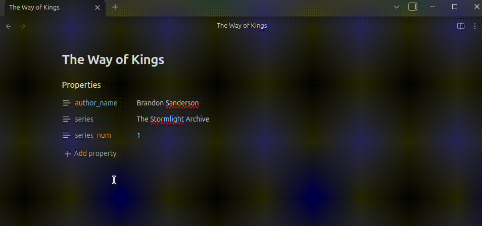

# Embed Metadata
Render frontmatter metadata (Obsidian Properties) inside your notes with a lightweight inline `[%key]` or `{{key}}` syntax.

The intent for developing this is as a lightweight replacement for Dataviews `=this.key` embedded metadata rendering, specifically if [Obsidian Bases](https://help.obsidian.md/bases) cover most everything else.

## Demo


## Installation

This plugin is not yet added to the Community List, pending approval. You can either manually install it by creating a folder within your `.obsidian/plugin/` folder called `embed-metadata` and and download a release within, resulting in a `main.js`, `style.css` and `manifest.js`.

The easiest way would be by adding this repository to [BRAT](https://github.com/TfTHacker/obsidian42-brat), a plugin installer from the community which you can install via  Obsidian.

## Usage
Add frontmatter (Properties) to a note:

```yaml
---
title: Stay out of the sun!
tags:
  - Alexander
  - Cynic
author_name: Diogenes
---
```

Then reference it in the note body:

```markdown
What do you think of [%title] as book title?
We recommend using those tags: [%tags]
The Author called [%author_name] is really funny!
```

The syntax markers are replaced in reading view and live preview. Source mode keeps
the syntax as plain text. If a key is missing, the marker is left unchanged.
Inline code and code blocks are ignored in preview. If a key exists but has no
value, the marker renders empty.

Built-in keys (when enabled):
- `filename` (full file name with extension)
- `basename` (file name without extension)
- `extension`
- `path` (vault-relative path)
- `folder` (parent folder path)
- `link` (wikilink to the file)
- `ctime` (created time)
- `mtime` (last modified time)

## Settings

Use **Settings → Community plugins → Embed Metadata** to choose the syntax
format: `[%key]` or `{{key}}`.
- Optional case-insensitive key lookup
- Optional built-in keys (enabled by default; frontmatter keys take priority)
- Optional outline rendering (experimental; replaces markers in the Outline sidebar)

Visual look options apply in Live Preview:
- Bold / Italic / Underline toggles
- Optional underline color override (defaults to text color)
- Optional highlight with theme color or override
- Hover emphasis (subtle style shift on hover)

Note: Obsidian Properties do not support nested properties in Reading view or Live Preview.
If you use nested YAML, use Source mode to view them, or flatten keys (for example,
`author_name`).

## Migration

You can migrate existing notes:
- **Migrate from dataview** converts dataviews backticked `=this.key` syntax to your selected format.
- **Migrate to current syntax** converts the other supported syntax formats to the selected one.

Each migration opens a review modal listing matching files with counts. Deselect any
files you want to skip, then confirm the migration (it edits your files).

## Autocomplete
Type the configured opener (`[%` or `{{`) to see a dropdown of frontmatter keys
from the current file. Results are sorted alphabetically and update as you type.

## Disclaimer
AI was used during the development of this project.
